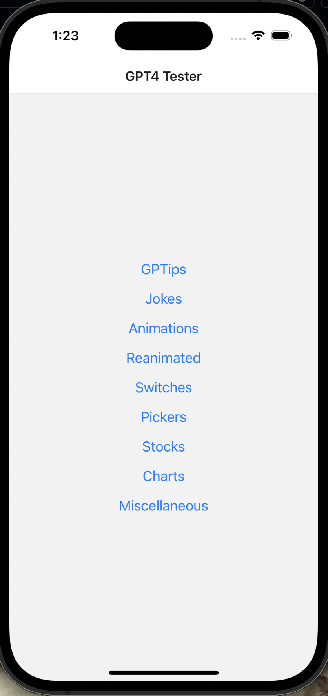
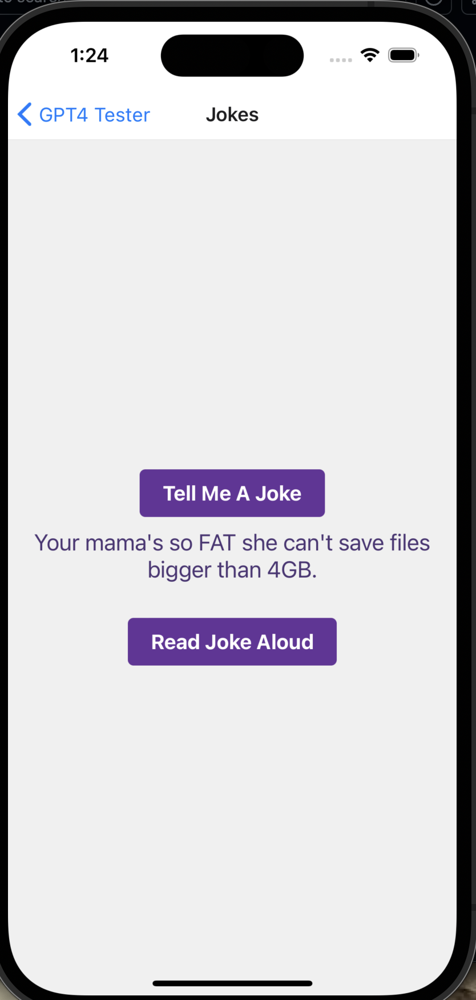
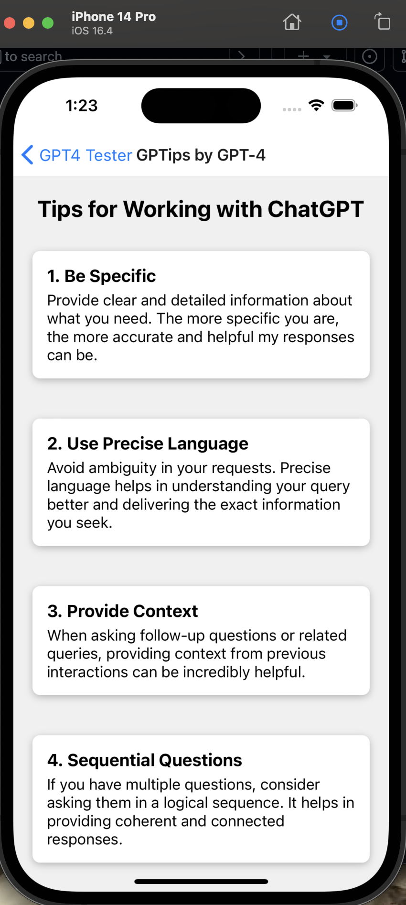
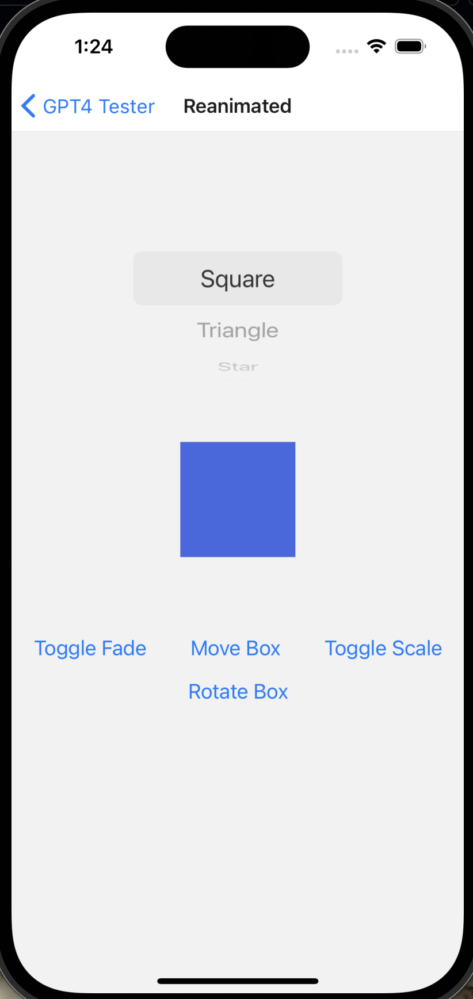

  <table>
    <tr>
      <td></td>
      <td></td>
      <td></td>
      <td></td>
    </tr>
    <tr>
      <td height="16"></td>
      <td height="16"></td>
    </tr>
  </table>

# ReanimatedAnimationsScreen Component Documentation

This project demonstrates a comprehensive approach to using React Native's `Animated` library to create a variety of animations, showcasing different animation techniques such as fading, scaling, sliding, rotating, and more complex sequences like parallel and staggered animations.

## Custom Hooks for Animations

### `useFadeAnimation`

- **Purpose**: Creates a fade-in effect by animating the opacity of a component from 0 to 1.
- **Usage**: Ideal for fade-in animations on component mount or in response to an event.

### `useScaleAnimation`

- **Purpose**: Scales a component from 0 to its original size, giving an effect of the component growing into its place.
- **Usage**: Useful for drawing attention to a component or revealing it dynamically.

### `useSlideAnimation`

- **Purpose**: Slides a component from off-screen (-100 pixels on the Y-axis) to its original position.
- **Usage**: Great for slide-in animations for components entering the viewport.

### `useRotateAnimation`

- **Purpose**: Rotates a component a full 360 degrees.
- **Usage**: Can be used for loading indicators or to add flair to icon animations.

### `useParallelAnimation`

- **Purpose**: Runs fade and scale animations in parallel, demonstrating how to combine animations to run simultaneously.
- **Usage**: Suitable for complex entrance animations that require multiple properties to animate together.

### `useStaggerAnimation`

- **Purpose**: Staggers the fade-in and fade-out animations with a delay, creating a sequence of animations one after the other.
- **Usage**: Ideal for animating a list of items or creating a sequence of animations that shouldn't run at the same time.

### `useLoopAnimation`

- **Purpose**: Repeats a fade-in animation four times, showcasing how to loop animations.
- **Usage**: Useful for continuous animations, like a pulsing effect.

### `useStreamersAnimation`

- **Purpose**: Combines vertical movement and rotation in a looping sequence, simulating a floating and rotating effect.
- **Usage**: Effective for background animations or adding ambient movement to a screen.

## `AnimationsScreen` Component

- **Purpose**: Demonstrates the usage of the custom animation hooks by providing a UI with buttons to trigger each animation.
- **Features**: 
  - Multiple `StyledButton` components, each linked to a different animation.
  - A `ConfettiCannon` component that fires confetti as an example of using third-party animation libraries alongside native animations.
- **Styling**: Follows a cohesive style guide, presumably aligning with Ally's theming, to provide a visually consistent user experience.

## Styling and Structure

The project utilizes React Native's `StyleSheet` for theming, ensuring that the animations not only perform well but also look integrated into the application's design language. Each animation hook returns an object containing the animated style properties and a `start` function to trigger the animation, encapsulating the animation logic neatly for use in any component.

## Usage

To use these animations in your application, import the desired hook(s) from `animationExamples.tsx`, attach the returned animated style to your component, and trigger the animation using the `start` function, typically in response to user interaction.

# ReanimatedAnimationsScreen Component Documentation

The `ReanimatedAnimationsScreen` component demonstrates the use of the `react-native-reanimated` library to create dynamic animations for different shapes. It allows users to select between a square, triangle, star, or the text "Ally" and apply various animations like fading, scaling, moving, and rotating to the selected shape.

## Features

- **Shape Selection**: Utilizes `@react-native-picker/picker` for shape selection.
- **Dynamic Animations**: Leverages `react-native-reanimated` for fluid animations.
- **SVG Shapes**: Incorporates `react-native-svg` for rendering triangle and star shapes.
- **Adaptive Styling**: Uses `Platform` from `react-native` to adjust styles based on the operating system.

## State Management

- `shape`: A state that tracks the currently selected shape.
- Utilizes the `useState` hook from React for state management.

## Animations

- **Opacity**: Uses a shared value to toggle the opacity of the selected shape, creating a fade effect.
- **TranslateX**: Moves the shape horizontally across the screen.
- **Scale**: Dynamically scales the shape up or down.
- **Rotation**: Rotates the shape around its center.

Animations are triggered by buttons that utilize `withTiming` from `react-native-reanimated` to smoothly transition animation values.

## Rendering Shapes

Shapes are conditionally rendered based on the `shape` state:

- **Square**: A simple view with a fixed size and background color.
- **Triangle**: Rendered using `Polygon` from `react-native-svg`.
- **Star**: Rendered using `Path` from `react-native-svg`.
- **Ally**: Displays the text "Ally" which can also be animated.

## Styles

- The component uses `StyleSheet` for styling.
- Adaptively adjusts the top padding based on the platform to ensure the picker is visible on Android devices.
- The shapes and buttons are centrally aligned, with additional styling to support the visibility and aesthetics of the animations.

## Usage

This component serves as a showcase for implementing and controlling animations with `react-native-reanimated`. It provides a practical example of how animations can enhance interactivity in a React Native application.

