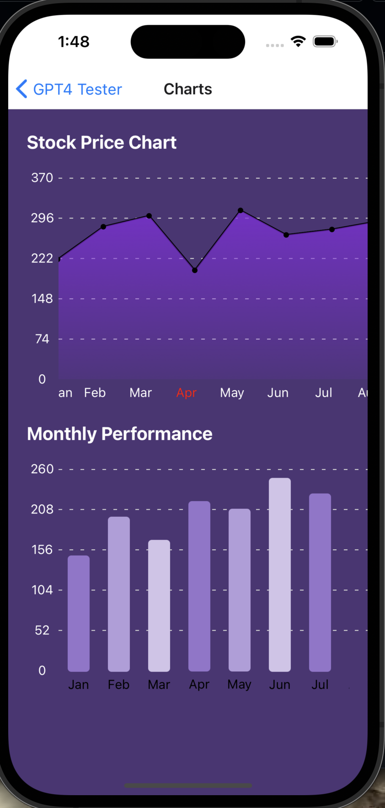
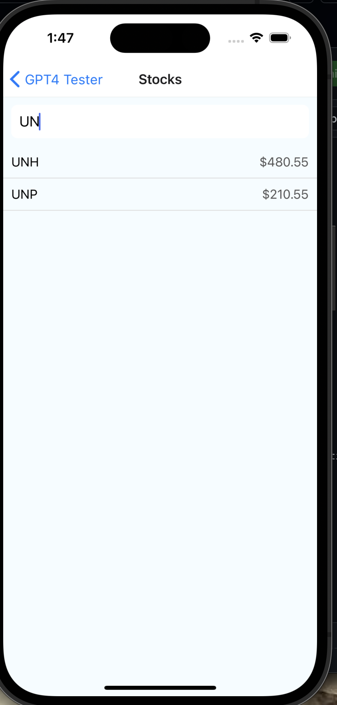
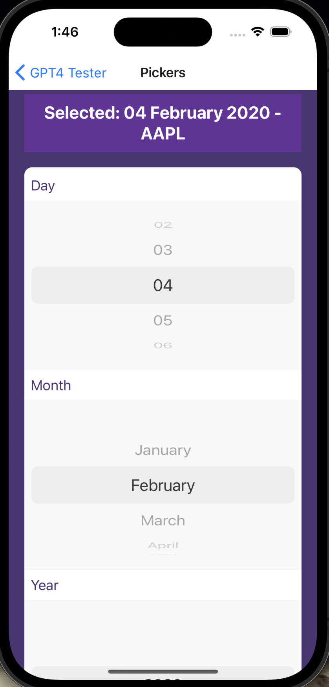
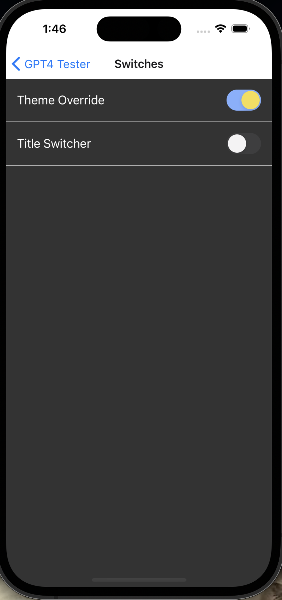

  <table>
    <tr>
      <td></td>
      <td></td>
      <td></td>
      <td></td>
    </tr>
    <tr>
      <td></td>
      <td></td>
      <td></td>
      <td></td>
    </tr>
    <tr>
      <td height="16"></td>
      <td height="16"></td>
    </tr>
  </table>

# GPT_Tester Application Overview

The `GPT_Tester` application serves as a hub for various demonstrations, including tips for working with ChatGPT, jokes, animations, and more, showcasing the versatility of React Native and the power of GPT-4.

## HomeScreen Component

The `HomeScreen` component acts as the main entry point for the application. It presents a series of buttons, each navigating to a different feature screen within the app.

### Features

- **Navigation**: Utilizes `@react-navigation/stack` to navigate between different feature screens.
- **User Interface**: Provides a simple, user-friendly interface with buttons to access each feature of the app.

### Navigation Options

The `HomeScreen` offers navigation to the following screens:

- **GPTips by GPT-4**: Tips for getting the most out of ChatGPT.
- **Jokes**: A collection of jokes fetched from an external API.
- **Animations**: Demonstrations of basic animations.
- **Reanimated**: Showcases advanced animations using `react-native-reanimated`.
- **Switches**: Examples of toggle switches.
- **Pickers**: Demonstrations of picker components.
- **Stocks**: Displays stock information.
- **Charts**: Shows various charts.
- **Miscellaneous**: A collection of miscellaneous demonstrations.

## GPT_Tester Component

The `GPT_Tester` function wraps the entire application within a `NavigationContainer` and defines the navigation stack, linking the `HomeScreen` to various feature screens.

### Integration

- **React Navigation**: The app uses React Navigation for managing screen transitions and stack navigation.
- **React Native Screens**: Employs `react-native-screens` for enhanced performance and native navigation capabilities.

### Styling

The app adopts a minimalist styling approach, emphasizing functionality and ease of use. The `HomeScreen` uses a scrollable view to accommodate devices of varying sizes and orientations.

## Usage

To run the `GPT_Tester` application:

1. Ensure you have React Native and the required libraries installed.
2. Navigate to the project directory and run:

npx react-native run-android
# or
npx react-native run-ios

# TipsForChatGPTScreen Component Documentation

The `TipsForChatGPTScreen` component is designed to educate users on the best practices for interacting with ChatGPT. It's built using React Native and presents several tips through a scrollable view, ensuring a user-friendly experience on both iOS and Android devices.

## Features

- **Scrollable Content**: Allows users to smoothly scroll through different tips, accommodating extensive information without overwhelming the screen space.
- **Styled Tips**: Each tip is contained within its own view with a background, shadow, and rounded corners, improving readability and user engagement.
- **Responsive Design**: Adapts to different screen sizes and orientations thanks to the flexible layout provided by `ScrollView` and `StyleSheet`.

## Best Practices Highlighted

1. **Be Specific**: Encourages providing clear, detailed information for more accurate responses.
2. **Use Precise Language**: Stresses the importance of avoiding ambiguity to enhance understanding.
3. **Provide Context**: Suggests including details from previous interactions for better follow-up responses.
4. **Sequential Questions**: Advises on asking questions in a logical sequence for coherent answers.
5. **Patience is Key**: Reminds users that some queries require more processing time.
6. **Feedback is Welcome**: Invites users to offer feedback to help improve ChatGPT's responses.

## Styling

- The component utilizes a light background (`#F0F0F0`) for the main view, with white, elevated tip containers to draw attention to the advice.
- Tips titles are bold and slightly larger to distinguish them from their descriptions, which provide the actionable advice in a slightly smaller font size.
- Margins and paddings are carefully applied to ensure ample white space for a clean and accessible layout.

## Code Snippet

const TipsForChatGPTScreen = () => {
  // Component logic and rendering
};

# JokesScreen Component Documentation

The `JokesScreen` component is designed to fetch and display jokes from the "JokeAPI". It showcases the integration of network requests within a React Native application and utilizes the `expo-speech` library to read jokes aloud, enhancing accessibility and user interaction.

## Features

- **Joke Fetching**: Leverages `axios` to make HTTP GET requests to the JokeAPI for random jokes.
- **Loading State**: Incorporates an `ActivityIndicator` to indicate ongoing network requests.
- **Text-to-Speech**: Uses `expo-speech` to read the joke out loud, providing an interactive experience.
- **Styling**: Adheres to an Ally Bank-inspired theme with a focus on accessibility and usability.

## Functionality

- **Fetching Jokes**: Upon tapping the "Tell Me A Joke" button, the component initiates a request to fetch a random joke. It handles both successful responses and errors gracefully, updating the UI accordingly.
- **Reading Jokes Aloud**: If a joke is successfully fetched, an additional button "Read Joke Aloud" is displayed, which, when pressed, invokes the text-to-speech functionality to narrate the joke.

## State Management

- `joke`: Stores the current joke or an error message.
- `loading`: Tracks the loading state of the joke fetching process.

Utilizes the `useState` hook for state management, ensuring component reactivity to state changes.

## Error Handling

Implements basic error handling for network request failures or if the fetched data does not meet the expected format, providing user feedback through UI updates.

## Styling

The component is styled to align with the Ally Bank theme, featuring:

- **Container**: A flex container that centers its content, with a light background for contrast.
- **Buttons**: Styled with the Ally Bank's purple hue, rounded corners, and margin for separation.
- **Text**: Joke text is displayed in a dark purple for readability, with an increased font size to accommodate various screen sizes and user needs.

### Usage

This component can be integrated into any React Native app requiring light-hearted, interactive content. It demonstrates practical applications of network requests, state management, and third-party library integration in React Native.

import JokesScreen from './path/to/JokesScreen';

# React Native Animation Examples

This project demonstrates a comprehensive approach to using React Native's `Animated` library to create a variety of animations, showcasing different animation techniques such as fading, scaling, sliding, rotating, and more complex sequences like parallel and staggered animations.

## Custom Hooks for Animations

### `useFadeAnimation`

- **Purpose**: Creates a fade-in effect by animating the opacity of a component from 0 to 1.
- **Usage**: Ideal for fade-in animations on component mount or in response to an event.

### `useScaleAnimation`

- **Purpose**: Scales a component from 0 to its original size, giving an effect of the component growing into its place.
- **Usage**: Useful for drawing attention to a component or revealing it dynamically.

### `useSlideAnimation`

- **Purpose**: Slides a component from off-screen (-100 pixels on the Y-axis) to its original position.
- **Usage**: Great for slide-in animations for components entering the viewport.

### `useRotateAnimation`

- **Purpose**: Rotates a component a full 360 degrees.
- **Usage**: Can be used for loading indicators or to add flair to icon animations.

### `useParallelAnimation`

- **Purpose**: Runs fade and scale animations in parallel, demonstrating how to combine animations to run simultaneously.
- **Usage**: Suitable for complex entrance animations that require multiple properties to animate together.

### `useStaggerAnimation`

- **Purpose**: Staggers the fade-in and fade-out animations with a delay, creating a sequence of animations one after the other.
- **Usage**: Ideal for animating a list of items or creating a sequence of animations that shouldn't run at the same time.

### `useLoopAnimation`

- **Purpose**: Repeats a fade-in animation four times, showcasing how to loop animations.
- **Usage**: Useful for continuous animations, like a pulsing effect.

### `useStreamersAnimation`

- **Purpose**: Combines vertical movement and rotation in a looping sequence, simulating a floating and rotating effect.
- **Usage**: Effective for background animations or adding ambient movement to a screen.

## `AnimationsScreen` Component

- **Purpose**: Demonstrates the usage of the custom animation hooks by providing a UI with buttons to trigger each animation.
- **Features**: 
  - Multiple `StyledButton` components, each linked to a different animation.
  - A `ConfettiCannon` component that fires confetti as an example of using third-party animation libraries alongside native animations.
- **Styling**: Follows a cohesive style guide, presumably aligning with Ally's theming, to provide a visually consistent user experience.

## Styling and Structure

The project utilizes React Native's `StyleSheet` for theming, ensuring that the animations not only perform well but also look integrated into the application's design language. Each animation hook returns an object containing the animated style properties and a `start` function to trigger the animation, encapsulating the animation logic neatly for use in any component.

## Usage

To use these animations in your application, import the desired hook(s) from `animationExamples.tsx`, attach the returned animated style to your component, and trigger the animation using the `start` function, typically in response to user interaction.

# ReanimatedAnimationsScreen Component Documentation

The `ReanimatedAnimationsScreen` component demonstrates the use of the `react-native-reanimated` library to create dynamic animations for different shapes. It allows users to select between a square, triangle, star, or the text "Ally" and apply various animations like fading, scaling, moving, and rotating to the selected shape.

## Features

- **Shape Selection**: Utilizes `@react-native-picker/picker` for shape selection.
- **Dynamic Animations**: Leverages `react-native-reanimated` for fluid animations.
- **SVG Shapes**: Incorporates `react-native-svg` for rendering triangle and star shapes.
- **Adaptive Styling**: Uses `Platform` from `react-native` to adjust styles based on the operating system.

## State Management

- `shape`: A state that tracks the currently selected shape.
- Utilizes the `useState` hook from React for state management.

## Animations

- **Opacity**: Uses a shared value to toggle the opacity of the selected shape, creating a fade effect.
- **TranslateX**: Moves the shape horizontally across the screen.
- **Scale**: Dynamically scales the shape up or down.
- **Rotation**: Rotates the shape around its center.

Animations are triggered by buttons that utilize `withTiming` from `react-native-reanimated` to smoothly transition animation values.

## Rendering Shapes

Shapes are conditionally rendered based on the `shape` state:

- **Square**: A simple view with a fixed size and background color.
- **Triangle**: Rendered using `Polygon` from `react-native-svg`.
- **Star**: Rendered using `Path` from `react-native-svg`.
- **Ally**: Displays the text "Ally" which can also be animated.

## Styles

- The component uses `StyleSheet` for styling.
- Adaptively adjusts the top padding based on the platform to ensure the picker is visible on Android devices.
- The shapes and buttons are centrally aligned, with additional styling to support the visibility and aesthetics of the animations.

## Usage

This component serves as a showcase for implementing and controlling animations with `react-native-reanimated`. It provides a practical example of how animations can enhance interactivity in a React Native application.

# SwitchesScreen Component Documentation

The `SwitchesScreen` component demonstrates the use of switch toggles in a React Native application, providing interactive elements for changing app settings such as themes and screen titles dynamically.

## Features

- **Theme Override**: Includes a switch for toggling between light and dark themes.
- **Title Switcher**: Features a switch to toggle the screen's title between "Switches" and "Switched".

## Implementation Details

- **State Management**: Uses the `useState` hook for managing the states of theme and title switches.
- **Dynamic Styling**: Applies conditional styling based on the current theme state, altering background and text colors.
- **Navigation Options**: Dynamically changes the screen's title based on the switch's state using `navigation.setOptions`.

## Functionality

- **Toggle Theme**: The theme switch triggers a state change that can be expanded to implement full theme switching logic across the app, potentially using context or global state management.
- **Toggle Title**: The title switch modifies the screen's title, demonstrating dynamic navigation options.

# PickersScreen Component Documentation

The `PickersScreen` component in a React Native application showcases various picker implementations, including a native picker component for selecting days, months, years, and top stock symbols. Additionally, it features a custom picker designed to mimic the native picker's functionality but with a unique user interface experience.

## Features

- **Native Picker Integration**: Utilizes the `@react-native-picker/picker` for selecting day, month, year, and a top stock symbol from predefined lists.
- **Custom Picker**: Implements a custom picker for selecting numbers, demonstrating an alternative approach to the native picker component.
- **State Management**: Manages selected values using the `useState` hook, allowing for dynamic updates across the user interface.

## Implementation Details

- **Dynamic Lists**: Generates lists for days, months, years, and top stock symbols dynamically, facilitating easy updates and maintenance.
- **Custom Picker Scrolling**: The custom picker uses a `ScrollView` with `snapToInterval` for a smooth selection experience, closely mimicking native picker behavior.
- **Styling**: Applies conditional styling based on selected themes and utilizes `StyleSheet` for a cohesive look and feel aligned with the application's design system.

## CustomPicker Component

A specialized component designed to offer an alternative picker experience. It accepts an array of data and a callback function as props, rendering each item as a selectable option within a scrollable view.

### Usage

To use the `CustomPicker` within your application:

1. Import the `CustomPicker` component.
2. Pass the data array and a callback function for handling value changes.

## Styling

The component employs a variety of styles to achieve an attractive and intuitive user interface:

- **Container Styles**: Defines the overall layout, including background color and padding.
- **Picker Styles**: Styles for the native picker components, ensuring consistency with the application's theme.
- **Custom Picker Styles**: Specific styles for the custom picker, including item height for `snapToInterval` functionality and visual properties like borders and background color.

## Extensibility

The `PickersScreen` component is designed with extensibility in mind. Additional picker options can easily be integrated by expanding the state management logic and updating the UI to include new picker components as needed.

